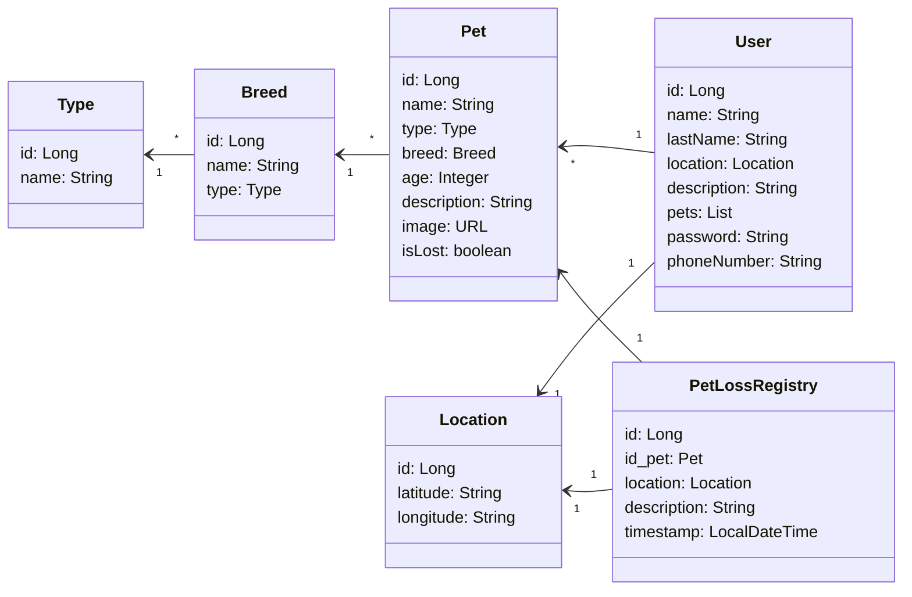

# PET-APPLICATION 

                                                          BACKEND DESIGN 

```mermaid
classDiagram

direction RL
User "1" --> "*" Pet
PetLossRegistry "1" --> "1" Pet
User "1" --> "1" Location
PetLossRegistry "1" --> "1" Location
Breed "*" --> "1" Type
Pet "*" --> "1" Breed

class `User` {
        id: Long
        name: String
        lastName: String
        location: Location
        description: String
        pets: List<Pet>
        password: String
        phoneNumber: String
}

 class `Pet` {
        id: Long
        name: String
        type: Type
        breed: Breed
        age: Integer
        description: String
        image: URL
        isLost: boolean
}

class `PetLossRegistry` {
        id: Long
        id_pet: Pet
        location: Location
        description: String
        timestamp: LocalDateTime
}

class `Location`{
      id: Long
      latitude: String
      longitude: String
}

class `Breed`{
      id: Long
      name: String
      type: Type
}

class `Type`{
      id: Long
      name: String
}
```
