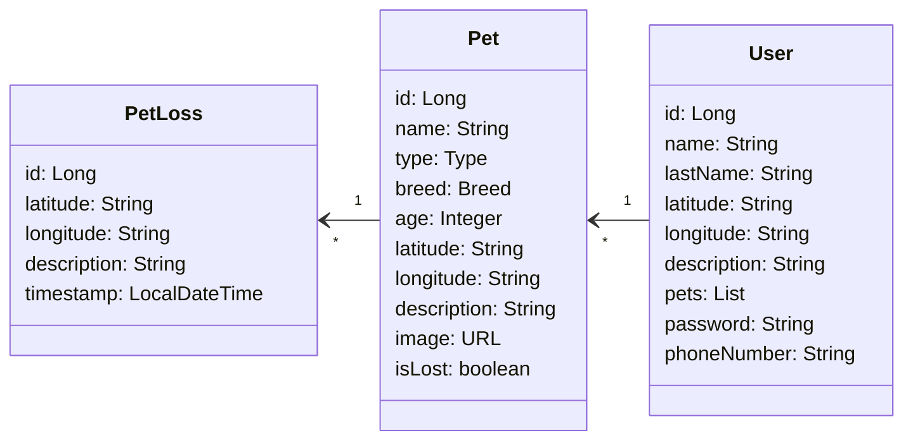

# PET-APPLICATION 

                                                          BACKEND DESIGN 

```mermaid
classDiagram

direction RL
User "1" --> "*" Pet
Pet "1" --> "*" PetLoss

class `User` {
        id: Long
        name: String
        lastName: String
        latitude: String
        longitude: String
        description: String
        pets: List<Pet>
        password: String
        phoneNumber: String
    }

 class `Pet` {
        id: Long
        name: String
        type: Type
        breed: Breed
        age: Integer
        latitude: String
        longitude: String
        description: String
        image: URL
        isLost: boolean
    }

class `PetLoss` {
        id: Long
        latitude: String
        longitude: String
        description: String
        timestamp: LocalDateTime
    }
```
