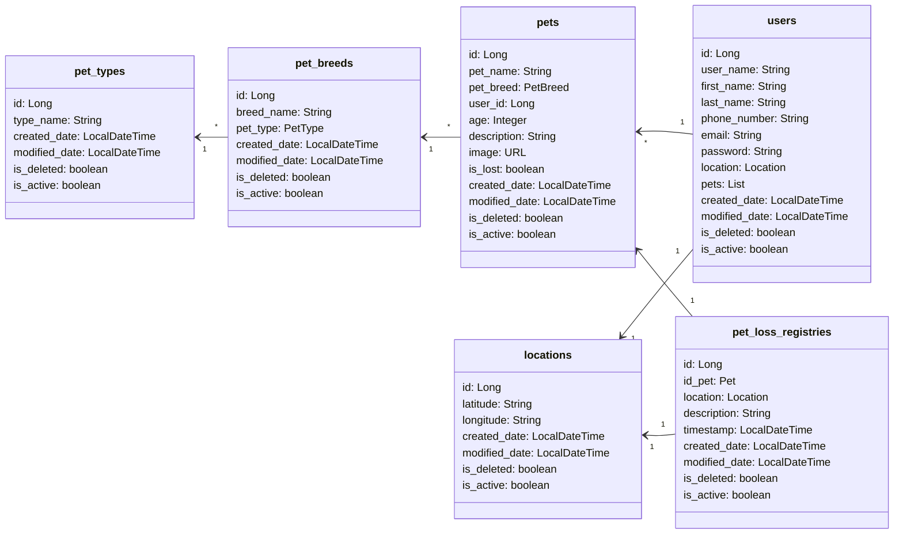

# PET-APPLICATION 

                                                          BACKEND DESIGN 

```mermaid
classDiagram

    direction RL
    users "1" --> "*" pets
    pet_loss_registries "1" --> "1" pets
    users "1" --> "1" locations
    pet_loss_registries "1" --> "1" locations
    pet_breeds "*" --> "1" pet_types
    pets "*" --> "1" pet_breeds

    class `users` {
        id: Long
        
        user_name: String
        first_name: String
        last_name: String
        phone_number: String
        email: String
        password: String
        location: Location
        pets: List<Pet>
        
        created_date: LocalDateTime
        modified_date: LocalDateTime
        is_deleted: boolean
        is_active: boolean
    }

    class `pets` {
        id: Long
        
        pet_name: String
        pet_breed: PetBreed
        user_id: Long
        age: Integer
        description: String
        image: URL
        is_lost: boolean

        created_date: LocalDateTime
        modified_date: LocalDateTime
        is_deleted: boolean
        is_active: boolean
    }

    class `pet_loss_registries` {
        id: Long
        
        id_pet: Pet
        
        location: Location
        description: String
        timestamp: LocalDateTime

        created_date: LocalDateTime
        modified_date: LocalDateTime
        is_deleted: boolean
        is_active: boolean
    }

    class `locations` {
        id: Long
        
        latitude: String
        longitude: String

        created_date: LocalDateTime
        modified_date: LocalDateTime
        is_deleted: boolean
        is_active: boolean
    }

    class `pet_breeds` {
        id: Long
        
        breed_name: String
        pet_type: PetType

        created_date: LocalDateTime
        modified_date: LocalDateTime
        is_deleted: boolean
        is_active: boolean
    }

    class `pet_types` {
        id: Long
        
        type_name: String

        created_date: LocalDateTime
        modified_date: LocalDateTime
        is_deleted: boolean
        is_active: boolean
    }
```
